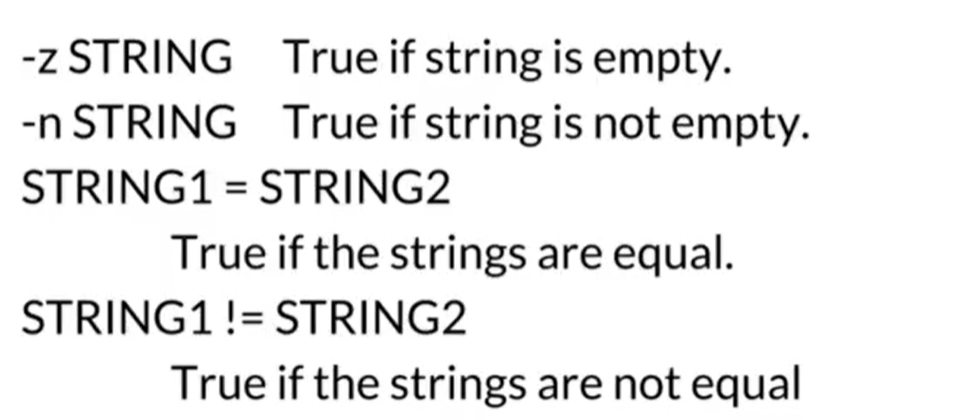

# Shell script
<details>
    <summary>General</summary>

### $ :
- Get value of variable
```
#!/bin/bash -x
TEST_VAR="test"
echo ${TEST_VAR}
```
- Get value of parameter: $1, $2, ...
- Get value of previouse command: "$?" (the value from 0 to 255, 0:success)
- 
### Variable:
- Valid names:
> FIRST3LETTER="ABC"
> FIRST_LETTER="A"
> firstThreeLetter="ABC"

- Invalid names:
> 3LETTERS
> first-three-letter
> first@Three@Letter

- Scope: **global** default, **local** (use "local" before var)
### Condition:
- Syntax: ```[ condition-to-test ]```
- Compare string:

- Arithmetic :


### if statement
- Syntax: 

### for loop
> for VARIABLE in VALUE1 VALUE2 VALUE3
> do
>   COMMAND ...
> done

### while loop
> while [ condition ]
> do
>   COMMAND ...
> done

### exit command
- Use to end script, and return value(0-255)

### function
- Seam as void function

</details>
<details>
    <summary>Debug in shell</summary>

- Trace all commands in file:  "-x"
```
#!/bin/bash -x
TEST_VAR="test"
echo $TEST_VAR
```
> Result:
 
 
- Trace part of file: use pair: ```set -x``` and ```set +x```
```
#!/bin/bash -x
TEST_VAR="test"
set -x
echo $TEST_VAR
set +x
```
> Result: 
> 

- Exit on error: "-e" (abort script at first error)
- Syntax check (not execute file): "-n"
- Print each command before executing: "-v"
- Look more at: [Bash options](https://tldp.org/LDP/abs/html/options.html)

</details>


<details>
<summary>grep</summary>

```
grep "error" log.txt  # Search for lines containing "error" in log.txt
```

### **Key Features:**

- **Regular Expressions:** Supports powerful pattern matching using regular expressions.
- **Case Sensitivity:** By default, case-sensitive. Use ```- i``` for case-insensitive search.
    
- **Invert Match:** Use ```- v``` to print lines that don't match the pattern.
    
- **Context:** Use ```- A``` to print lines after the match, ```- B``` for lines before, and ```- C``` for both.
    
- **File Types:** Can search multiple files or recursively through directories.
  
- **Color Highlighting:** Use ```- color``` to highlight matches (if supported).
    

### **Common Options:**

- **-i:** Case-insensitive search
- **-w:** Match whole words only
- **-n:** Print line numbers
- **-l:** List file names with matches, not the matching lines
- **-r:** Recursive search through directories
</details>

<details>
<summary>|</summary>


```
ls -l | grep ".txt"  # List files ending in ".txt"

```

**How it works: (~ seam as a pipeline)**
1. first command is input
2. Second one use received data,

**Common Uses:**

- **Filtering:** Use ```grep``` to filter output based on patterns.
    
    
    
- **Sorting:** Use ```sort``` to arrange data in a specific order.
    
    
    
- **Counting:** Use ```wc``` to count lines, words, or characters.
    
    
    
- **Transforming:** Use tools like ```sed``` or ```awk``` to modify text or data.
    
- **Combining Operations:** Chain multiple commands for complex tasks.

</details>

